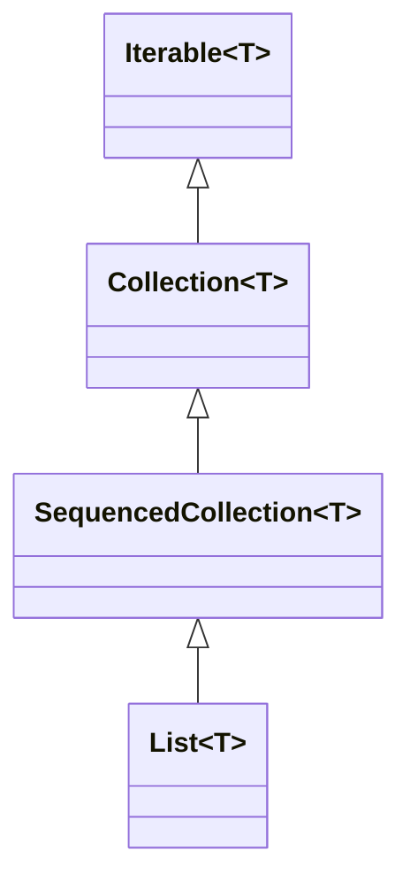

# Software Design and Architecture Week 2 Lab Solutions
Suggested answers to the Week 2 Lab Exercises

# Implement an Interface

We asked you to create various dice shakers implementing the dice shaker interface.

```java
public interface DiceShaker {
  boolean hasNext();
  int next();
}
```
Create an implementation that shakes a single die.

```java
public class RandomSingleDiceShaker implements DiceShaker {
  private static final Random random = new Random();

  @Override
  public boolean hasNext() {
    return true;
  }

  @Override
  public int next() {
    return random.nextInt(6) + 1;
  }
}
```
Create an implementation that shakes a two dice.
```java
public class RandomDoubleDiceShaker implements DiceShaker {
  private final DiceShaker shaker = new RandomSingleDiceShaker();

  @Override
  public boolean hasNext() {
    return true;
  }

  @Override
  public int next() {
    return shaker.next() + shaker.next();
  }
}
```
Create an implementation that returns a fixed set of “shakes”. The `hasNext` method should return false when there are no more values.

```java
public class FixedSingleDiceShaker implements DiceShaker {
  private final int[] shakes = new int[]{
      1, 2, 3, 4, 5, 6
  };

  private int index = 0;

  @Override
  public boolean hasNext() {
    return index < shakes.length;
  }

  @Override
  public int next() {
    return shakes[index++];
  }
}

```
We asked you to switch between different shakers based on a user input. This is a working solution, but it is not using the power of changing the implementation at runtime.

```java
public static void diceUseInterfaceBadly(int option) {
  System.out.format("diceUseInterfaceBadly option %d%n", option);
  if (option == 1) {
    RandomSingleDiceShaker shaker = new RandomSingleDiceShaker();
    for (int i = 0; (i < 10) && shaker.hasNext(); i++) {
      System.out.format("%s shake %d %d%n", shaker.getClass().getName(), i, shaker.next());
    }
  } else if (option == 2) {
    RandomDoubleDiceShaker shaker = new RandomDoubleDiceShaker();
    for (int i = 0; (i < 10) && shaker.hasNext(); i++) {
      System.out.format("%s shake %d %d%n", shaker.getClass().getName(), i, shaker.next());
    }
  } else {
    //bad stuff happens
  }
}

```
The issue here is that we are simply creating concrete instances and assigning them to different concrete types. The usage code is repeated and there is no default behavior if the option is greater than 2.

The correct way.
````java
public static void diceUseInterfaceWell(int option) {
  System.out.format("diceUseInterfaceWell option %d%n", option);
  DiceShaker shaker;
  if (option == 1) {
    shaker = new RandomSingleDiceShaker();
  } else if (option == 2) {
    shaker = new RandomDoubleDiceShaker();
  } else {
    shaker = new NullDiceShaker();
  }
  for (int i = 0; (i < 10) && shaker.hasNext(); i++) {
    System.out.format("%s %d%n", shaker.getClass().getName(), shaker.next());
  }
}
````
In this implementation there is a clear separation between choosing which concrete implementation to supply the abstract shaker and the usage of the code.

Furthermore, we can use the **Null Object** pattern to provide a default implementation for the default or fall-through case.

An implementation of the NullDiceShaker class returns false for the `hasNext()` method and throws an exception if `next()` is called.

```Java
public class NullDiceShaker implements DiceShaker {

  @Override
  public boolean hasNext() {
    return false;
  }

  @Override
  public int next() {
    throw new NoSuchElementException();
  }
}
```
> ⚠ The Null Object pattern is a design pattern that provides an object as a surrogate for the absence of a real object. Instead of using null references, you supply a special object that implements the expected interface but whose methods do nothing or return default values. This avoids NullPointerExceptions and simplifies client code by eliminating the need for null checks.

# Implementation using an Abstract class

You can also create DiceShakers using abstract classes and abstract methods.

Create an abstract superclass.

```java
public abstract class AbstractDiceShaker {
  private static final Random random = new Random();

  protected int shakeSingleDie() {
    //generate number between 1 and 6
    return random.nextInt(6) + 1;
  }

  public abstract boolean hasNext();
  public abstract int next();
}
```
Create concrete implementations for 1 and 2 die (as before).
```java
public class ConcreteSingleDiceShaker extends AbstractDiceShaker {

  @Override
  public boolean hasNext() {
    return true;
  }

  @Override
  public int next() {
    return this.shakeSingleDie();
  }
}
public class ConcreteDoubleDiceShaker extends AbstractDiceShaker {

  @Override
  public boolean hasNext() {
    return true;
  }

  @Override
  public int next() {
    return shakeSingleDie() + shakeSingleDie();
  }
}
```
The last task was “Now implement a version that provides a fixed set of ‘shakes’.“ using the abstract class.

You might have implemented this:

```java
//This doesn't really make sense because we are not using the protected method
public class FixedSingleDiceShaker extends AbstractDiceShaker {

  private final int[] shakes = new int[]{
      1, 2, 3, 4, 5, 6
  };

  private int index;

  @Override
  public boolean hasNext() {
    return index < shakes.length;
  }

  @Override
  public int next() {
    return shakes[index++];
  }
}
```
> ☠ This is bad design – although it inherits from AbstractDiceShaker it makes no use of the random number generator or the shakeSingleDie() method.

The learning point is that an interface defines a “can-do” capability independently of implementation, whereas an inheritance models an ‘is-an’ relationship, and in the Dice Shaker case, the fixed dice shaker is not an ‘is -a’ random shaker. This becomes apparent when you try an implement a subclass of AbstractDiceShaker that isn’t random.

True inheritance relationships are less common than you would think, which is one reason why we prefer to use interfaces as abstract types rather than abstract base classes.

It doesn’t mean that you can’t use inheritance, just it’s better to use inheritance to share implementation, rather than use a base class as the abstract type.

Here is a better design using an interface to represent the capability, and two classes happen to use inheritance to share some implementation because they are true specialisations.

```java
public interface DiceShaker {
  boolean hasNext();
  int next();
}
```

```java
public abstract class AbstractRandomDiceShaker implements DiceShaker{
  private final Random random = new Random();

  protected int shakeSingleDie() {
    //generate number between 1 and 6
    return random.nextInt(6) + 1;
  }

  @Override
  public boolean hasNext() {
    return true;
  }
}
```
Implement the concrete random shakers using inheritance to use the `shakeSingleDie()` method

```java
public class ConcreteRandomSingleDiceShaker extends AbstractRandomDiceShaker {

  @Override
  public int next() {
    return this.shakeSingleDie();
  }
}
```

```java
public class ConcreteRandomDoubleDiceShaker extends AbstractRandomDiceShaker {

  @Override
  public int next() {
    return this.shakeSingleDie() + this.shakeSingleDie();
  }
}
```
As both concrete classes have random shakes, they can reuse the implementation in the base class.

However, because we have an interface, we can have a completely independent implementation which does not need the Random number generator.

```java
public class FixedSingleDiceShaker implements DiceShaker {

  private final int[] shakes = new int[]{
      1, 2, 3, 4, 5, 6
  };

  private int index;

  @Override
  public boolean hasNext() {
    return index < shakes.length;
  }

  @Override
  public int next() {
    return shakes[index++];
  }
}
```
The client code doesn’t care if the concrete class is implemented using inheritance or not

```java
DiceShaker shaker = new ConcreteSingleDiceShaker();
shaker = new FixedSingleDiceShaker();
```
**Question: What problem can you see using the abstract base class to implement a fixed set of ‘shakes’.**
**Answer:** The fixed shaker is not a kind of random dice shaker, it doesn't have an 'is a' relationship with the base class.

**Question: What are the differences between implementing an interface and extending an abstract class.**
**Answer:** Using abstract classes allow you to reuse implementation, whereas an interface requires a full implementation.

> ☠ Although inheritance is taught as being one of the key features of OO languages, be very careful with its use.
> Inheritance models an “is-a” relationship, and it is often misused for code reuse.
> In this example, a fixed dice shaker is not "is a" kind of random dice shaker.
>
> Modelling a capability ('can do' ) via an interface is often better. In the example here we used inheritance for reuse between the random dice shakers, but were able to implement a fixed dice shaker independently because our abstract type was a 'can-do' interface.

Creating an abstract base class for some implementations of an interface is a good strategy where there is genuine code resue, but you can create other independent implementations of the interface as required.

Inheritance needs to be considered carefully.

- Subclasses are tightly coupled to their parent classes, making changes in the base class potentially break some or all subclasses.
- Inheritance models an “is-a” relationship, interfaces model a 'can do' relationship.
- Subclasses can access protected members of the superclass, potentially breaking encapsulation.

> ⚠ As a rule of thumb, when you are designing an abstraction, start with an interface and then consider if some implementations can use inheritance. Ensure that where inheritance is used it is because there are genuine specialisations of the base class.

# The Java Iterable and Iterator Interfaces

The ability to loop (iterate) over a collection of objects is a common requirement in programming, so much so there is are standard interfaces for it defined in the Java standard library.

In the FixedSingleDiceShaker example above we are looping over a fixed set of dice shakes. In the RandomSingleDiceShaker and RandomDoubleDiceShaker examples we are looping over an infinite sequence of random shakes.

Java provides built-in support for iteration via the generic `Iterable<T>` and `Iterator<T>` interfaces.

Iterable is a "capability" interface that marks a class as something that can be looped over, while Iterator the interface with the capability to iterate through a collection one element at a time.

## The Iterator<T> Interface

Iterator<T> is a cursor over a sequence: the interface definition is `boolean hasNext()` and `T next()`.  Any instance of an object implementing Iterator<T> is single-use: once advanced, it cannot be reset.

We can implement an Iterator for our FixedSingleDiceShaker.

```java
public class FixedSingleDiceIterator implements Iterator<Integer> {
    private final int[] shakes = new int[]{1, 2, 3, 4, 5, 6};
    private int index = 0;

    @Override
    public boolean hasNext() {
        return index < shakes.length;
    }

    @Override
    public Integer next() {
        if (!hasNext()) throw new NoSuchElementException();
        return shakes[index++];
    }
}
```
Each new instance of the iterator will start with index = 0, and therefore will start at the beginning of the sequence.

An implementation of an infinite single random dice shaker iterator is also possible.

```java
public class RandomSingleDiceIterator implements Iterator<Integer> {
    private final Random random = new Random();

    @Override
    public boolean hasNext() {
        return true; // infinite sequence
    }

    @Override
    public Integer next() {
        return random.nextInt(6) + 1;
    }
}
```

This is our original DiceShaker interface redefined as an Iterator<Integer>. Example usage:

```java
Iterator<Integer> iterator = new RandomSingleDiceIterator();
while (iterator.hasNext()) {
    int shake = iterator.next();
}
```
> ⚠ In Java we have to define the interface using the class `Integer` rather than the primitive `int` because Java generics (generic interfaces and generic classes)  cannot use primitive types as type parameters. Java generics cannot use primitives because they rely on **Type Erasure**, a mechanism that replaces all generic types with Object at runtime—and in Java, primitives do not inherit from Object.

## The Iterable<T> Interface

It is unusual to use an Iterator directly. Instead, we usually implement the Iterable<T> interface on a class that holds the collection of elements and create a new instance of the Iterator<T> to hold the state (the current index) of the iterator.

The Iterable<T> interface has a single method `Iterator<T> iterator()` that returns a new instance of an Iterator over the collection. This is best shown using the fixed dice shaker example.


```java
public class FixedSingleDiceIterable implements Iterable<Integer> {
    private final int[] shakes = new int[]{1, 2, 3, 4, 5, 6};

    private class FixedSingleDiceIterator implements Iterator<Integer> {
        private int index = 0;

        @Override
        public boolean hasNext() {
            return index < shakes.length;
        }

        @Override
        public Integer next() {
            if (!hasNext()) throw new NoSuchElementException();
            return shakes[index++];
        }
    }

    @Override
    public Iterator<Integer> iterator() {
        return new FixedSingleDiceIterator();
    }
}
```
> ⚠ Note how the Iterable implementation holds the collection, but creates a new instance of the Iterator each time the `iterator()` method is called. This allows multiple independent iterations over the same collection. Here we are using the private nested class feature of Java to privately encapsulate the Iterator implementation within the Iterable implementation.

An implementation of an infinite random single dice shaker iterable is also possible.

```Java
public class RandomSingleDiceIterable implements Iterable<Integer> {

    private final Random random = new Random();

    public class RandomSingleDiceIterator implements Iterator<Integer> {
        @Override
        public boolean hasNext() {
            return true; // infinite sequence
        }

        @Override
        public Integer next() {
            return random.nextInt(6) + 1;
        }
    }

    @Override
  public Iterator<Integer> iterator() {
    return new RandomSingleDiceIterator();
  }
}
```
Classes that implement Iterable<T> can be used directly in enhanced for-loops (for-each loops) in Java. There is a bit of syntactic sugar that makes this possible by automatically calling the `iterator()` method to get an Iterator instance.

```java
for(int shake : new FixedSingleDiceIterable()) {
    System.out.format("%d%n", shake);
}
 ```
If we were to use this pattern in the game we would break out of the loop when the game is won.

```java
for(int shake : new RandomSingleDiceIterable()) {
    //use the shake value
    if (gameIsWon()) {
        break;
    }
}
```

Implementing the `Iterable` and `Iterator` interfaces is a common pattern in Java to provide iteration capabilities over collections of objects. All the standard Java collections support the `Iterable` interface, and the `Collection<T>`, `Queue<T>`, and `Set<T>` interfaces extend `Iterable<T>`.

# Interface inheritance and class that implement multiple interfaces

Java supports interface inheritance, where one interface can extend another interface. This allows you to create a hierarchy of interfaces, where a sub-interface inherits the methods of its parent interface and can also define additional methods.

An example of interface inheritance.

```java
public interface InterfaceA {
  String someMethod();
}
public interface InterfaceB extends InterfaceA {
    String someOtherMethod();
}

public class ImplementationClass  implements InterfaceB{

    @Override
    public String someOtherMethod() {
        return "someOtherMethod";
    }

    @Override
    public String someMethod() {
        return "someMethod";
    }
}
```

An example of a class implementing multiple interfaces.

```java
public interface MyInterface {
  String someMethod();
}

public interface MyOtherInterface{
  String someOtherMethod();
}

public class ImplementationClass  implements MyInterface, MyOtherInterface {

  @Override
  public String someOtherMethod() {
    return "someOtherMethod";
  }

  @Override
  public String someMethod() {
    return "someMethod";
  }
}
```

In the interface inheritance example, the class is required to implement all methods from both interfaces. Because there is interface inheritance the two interfaces should be related. The second interface extends the first (adds more capability).

The Java collections framework makes extensive use of interface inheritance. For example, the `List<T>` interface extends the `SequenceCollection<T>` interface, which extends the  `Collection<T>` interface, which in turn extends the `Iterable<T>` interface. Any class that implements the `List<T>` interface 'can do' Collection operations and 'can do' iteration.




In the multiple interface implementation example, the two interfaces **do not** need to be related, they are completely independent. In this case we have taken the design decision that it is convenient for a single class to implement two separate interfaces.

> ⚠ Note that interface inheritance is not the same as class inheritance. In interface inheritance, a sub-interface inherits the method signatures of its parent interface but does not inherit any implementation. Any class that implements the subinterface has to implement all the methods of the sub interface and all its super interfaces.
> In class inheritance (subclassing), a subclass inherits both the method signatures **and** the implementation of its parent class..
