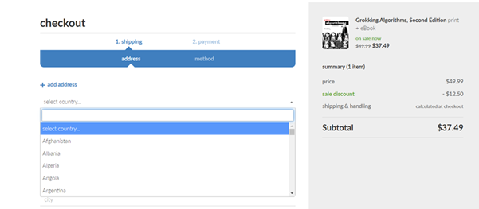
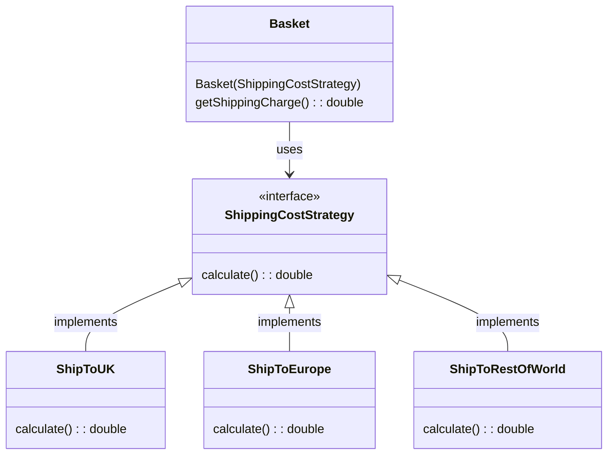

# Software Design and Architecture Week03 Lab Worksheet

There are multiple activities each week, and you will probably not get everything done in the timetabled lab sessions; therefore, it is highly recommended that you complete the labs in your own time each week to avoid falling behind.

Completing the labs will get you ready for writing the assignment code.

**Advanced** Labs are optional, but completing the Advanced Labs will introduce you to more advanced techniques and improve your design skills.

Week 3 labs are about some key object-oriented techniques – Value Objects and implementing Strategies.

IntelliJ has a quick and simple way of creating a new Java project that we can use for many of the labs.

Intelli-J File menu -\> New \> Project…

Provide a project name, chose a location and ensure that you have ticked the **Add sample code** box.

# Evaluate the design of the Polymorphic selling price product

Take a copy of the polymorphic selling price product from the `ValueObject` project from the Student code (you will need to get the code from the module GitHub repository if you do not have it already). Run the program to ensure it compiles and runs.

Examine the design of the classes in the `polymorphicsellingpriceproduct` package and ensure you understand how the polymorphic selling price product works.

What is wrong with the design of the Product class?, specifically the getPrice() method?

```java
class Product {

    private final MinimumPrice minimumPrice;
    private SellingPrice sellingPrice;

    public Product(FullPrice price, MinimumPrice minimumPrice) {
        this.sellingPrice = price;
        this.minimumPrice = minimumPrice;
    }

    public void applyDiscount(Discount discount) {

        sellingPrice = sellingPrice.applyDiscount(minimumPrice, discount);
    }

    public void removeDiscount() {

        sellingPrice = sellingPrice.removeDiscount();
    }

    public double getPrice() {
        return sellingPrice.get();
    }
}
```

# Add a Shipping Charge Value Object

Shopping websites usually calculate a shipping charge.


Using your copy of the polymorphic selling price product from the `polymorphicsellingpriceproduct` package:

- Add to the examples of using Value Objects for Full Price, Discount and Discounted Price by writing a Value Object called `ShippingCost` representing a Shipping and Handling cost (for example for a checkout process).
- Your `ShippingCost` Value Object should encapsulate a double value representing the shipping charge.
- A `ShippingCost` can have any non-negative value (0.0 or more).
- Your `ShippingCost` Value Object should follow all the rules for Value Objects. Use the Value Object checklist below to ensure you have covered all the points.

Extend the Product class to use your `ShippingCost` Value Object and extend the example code to show it in use. Your Product class should probably look like this:

```java
class Product {

    private final MinimumPrice minimumPrice;
    private final ShippingCost shippingCost;
    private SellingPrice sellingPrice;

    public Product(FullPrice price, MinimumPrice minimumPrice, ShippingCost shippingCost) {
        this.sellingPrice = price;
        this.minimumPrice = minimumPrice;
        this.shippingCost = shippingCost;
    }

    public ShippingCost getShippingCost() {
        return shippingCost;
    }

    //rest of implementation
}
```

Extend the example code to show the ShippingCost for the product and the total cost (the Selling Price + Shipping Cost). How will you handle the addition of a Selling Price and a Shipping Cost and the return of the total cost?

## Hints and Tips

> ☑ Most code you have written will use primitive types (strings, doubles and integers for example) to hold values. It is much better to work with dedicated classes that represent the values in your software design which encapsulate one or more primitive values. Although it is a bit more work to start with, every time you use an instance of your class rather than a primitive, you will see a benefit.

Value Objects encapsulate one or more primitive types in an immutable class. Immutable means that the data inside cannot be changed once created, so that they behave like primitive values (which also cannot be changed). To do this we declare all the fields as being final so that they can only be initialized in the constructor and never changed.

We can put all the pre-condition, post-condition and class invariant checking code in one place, guaranteeing that when we create an instance, it will be valid (providing you got your pre-conditions right of course). As these objects are immutable, once created, they always remain valid. Clients can then just use instance without having to do further checking, because of the guarantees we have built into the class.

Two instances of a Value Object are equal when the values of their instance variables are equal - in other words they have content equality. Value Object are classes that represent small things such as values or measures in a specific class, but in doing so provide a single place to put all the creation and usage logic.

Value Objects Checklist

  - There is no special Java keyword that makes a class a Value Object.

  - Value Objects are always immutable (like primitives) - their internal state cannot be changed once created.

  - Value Objects usually encapsulate a small number of primitive values or other Value Objects.

  - If they encapsulate reference types then those types MUST themselves be immutable.

  - Value Object implement content equality by overriding the equals() and the getHash() methods for testing the equality of contents.

  - Value Object implement override the toString() method.

  - We frequently create static final instances for common concepts such as zero or empty. This means we don't have to create new physical instances for common values, which can be an issue in large systems. Because the Value Object is immutable, there is no problem providing a static instance.

  - Being immutable, value objects are simpler to use and reason about since they can’t change state after creation. They are also inherently thread-safe, because multiple threads can use them simultaneously without risk of their state being changed.

A template for a ValueObject.
```java
import java.util.Objects;

public final class ValueObject {

    //Create a Constant object that represents a common value such as Zero or One
    public final static ValueObject Zero = new ValueObject(0);
    public final static ValueObject One  = new ValueObject(1);

    private final int value;

    public ValueObject(int value) {
        this.value = value;
    }

    public int getValue() {
        return value;
    }

    @Override
    public boolean equals(Object obj) {
        if (this == obj) {
            return true;
        }
        if (obj == null || getClass() != obj.getClass()) {
            return false;
        }
        ValueObject that = (ValueObject) obj;
        return value == that.value;
    }

    @Override
    public int hashCode() {
        return Objects.hash(value);
    }

    @Override
    public String toString()
    {
        return String.format("%d", value);
    }
}
```

> ☑ Intelli J supports the automatic creation of the equals(), hashCode() and toString() methods, which saves a lot of time when creating Value Objects.
>
>
> Right click in the class body to get a context menu with the **Generate.. (Alt+Insert)** option
>
> This then provides a Generate menu with options for equal(), hashCode() and toString().
>
> The Generate menu also supports creating constructors, getters and other code.
>
>Professional developers make use all the code generation and refactoring tools provided by an IDE to save writing boilerplate code and improve productivity.


# Implement a Strategy Pattern for Calculating Shipping Costs



The implementation of a simple book shopping site uses this class to represent the product

```java
import java.util.Objects;

class Product {

    private final String itemCode;
    private final String name;
    private final double weight;

    public Product(String itemCode, String name, double weight) {
        this.itemCode = itemCode;
        this.name = name;
        this.weight = weight;
    }

    public String getItemCode() {
        return itemCode;
    }

    public String getName() {
        return name;
    }

    public double getWeight() {
        return weight;
    }

    @Override
    public boolean equals(Object o) {
        if (!(o instanceof Product product)) return false;
        return Objects.equals(itemCode, product.itemCode);
    }

    @Override
    public int hashCode() {
        return Objects.hashCode(itemCode);
    }

    @Override
    public String toString() {
        return "Product{" +
                "itemCode='" + itemCode + '\'' +
                ", name='" + name + '\'' +
                '}';
    }
}

```

The code to calculate the shipping charge is in the Basket class and is based on a Destination.

```java
enum Destination {
    UK,
    Europe,
    RestOfWorld
}
```

```java
import java.util.ArrayList;
import java.util.List;

class Basket {
    private final List<Product> products = new ArrayList<>();
    private final Destination shipTo;


    public Basket(Destination shipTo) {
        this.shipTo = shipTo;
    }

    public void addProduct(Product product) {
        products.add(product);
    }

    public void removeProduct(Product product) {
        products.remove(product);
    }

    private double totalWeight()
    {
        double weight = 0.0d;
        for(Product product: products)
        {
            weight += product.getWeight();
        }
        return weight;
    }

    public double getShippingCharge()
    {
        return switch( shipTo) {
            case UK -> 0.0d; //Free Shipping in UK
            case Europe -> totalWeight() * 1.25; //£1.25 per Kg
            default -> switch (products.size()) //Rest of the World
            {
                case 0 -> 0.0d;
                default -> Math.max(10.00d, totalWeight() * 5.50); // higher of £10.00 or 5.50 per Kg
            };
        };
    }

}

```

An example usage for our basket class, in this case shipping to ROW.

```java
Product book1 = new Product("ABC123", "Agile Principles, Patterns, and Practices in Java", 1.02);
Product book2 = new Product("DEF456", "The Pragmatic Programmer", 0.62);
Product book3 = new Product("GHI789", "Refactoring : improving the design of existing code", 2.03);

Basket basket = new Basket(Destination.RestOfWorld);
basket.addProduct(book1);
System.out.format("Shipping %f%n", basket.getShippingCharge());

basket.addProduct(book2);
System.out.format("Shipping %f%n", basket.getShippingCharge());

basket.addProduct(book3);
System.out.format("Shipping %f%n", basket.getShippingCharge());

basket.removeProduct(book2);
System.out.format("Shipping %f%n", basket.getShippingCharge());
```

The lab task is to replace the Destination enum parameter with a Strategy Pattern, with 3 concrete strategies representing UK Shipping, Europe Shipping and Rest of World Shipping.

## Hints and Tips

The shipping cost calculation in the original code is an example of an algorithm. Algorithm is the term given to any sequence of steps to solve a problem, make a decision or calculate a value.

The shipping cost algorithm is the thing that is varying – extract it out of the Basket code and encapsulate each different calculation (algorithm) into its own class with a common interface (encapsulation).

You are looking to implement this arrangement.

The ShippingCostStrategy will be an interface that looks something like this in Java.



```java
interface ShippingCostStrategy {
    double calculate (List<Product> products);
}
```

Once you have this working, convert your solution to use the ShippingCost Value Object you produced in the first exercise (replacing the double primitive type with a Value Object).

# Implement the Bridge Pattern (Advanced)

The **More Ways of Handling Variation** chapter of the module textbook introduces the **Bridge** pattern.

Implement the example given that deals with Product and ProductPrinter using the code provided in the Variations project (bridgeproduct package) in the Student code repo (you will need to get the code from the module GitHub repository if you do not have it already).

All the code is provided, the objective of this advanced lab exercise to understanding how the pattern works.

Although usage of the Bridge pattern is not as common as the strategy pattern, it does solve some difficult design problems, so there is value in being aware of the pattern.

# Identify Candidate Classes for the Simple Frustration Game.

The assessment task is to write a simulation of a prototype physical board game called “Simple Frustration”. Full details are in the assessment brief in Moodle and there is a demo in Lecture 1 that shows an example simulation.

This lab exercise provides some time to identify some possible classes that model the key concepts and relationships within the game

• Entities: Things that represent important concepts or objects in the game

• Attributes: The “data” in Entities, either as primitives or (better) Value Objects

• Relationships between the classes

Some Kinds of classes

• Knowing: Knows and provides information (mostly holding data)

• Service Providing: Performs work on behalf of others (calculations, sending emails)

• Controlling: Makes decisions and delegates to other objects.

The Game also requires several variations. Identify the variations and how you might solve them using Strategies.

Use the lab time to get feedback from the tutors on you candidate classes.

# Implement a Strategy Pattern for Calculating Shipping Costs


The implementation of a simple book shopping site uses this class to represent the product

```java
import java.util.Objects;

class Product {

    private final String itemCode;
    private final String name;
    private final double weight;

    public Product(String itemCode, String name, double weight) {
        this.itemCode = itemCode;
        this.name = name;
        this.weight = weight;
    }

    public String getItemCode() {
        return itemCode;
    }

    public String getName() {
        return name;
    }

    public double getWeight() {
        return weight;
    }

    @Override
    public boolean equals(Object o) {
        if (!(o instanceof Product product)) return false;
        return Objects.equals(itemCode, product.itemCode);
    }

    @Override
    public int hashCode() {
        return Objects.hashCode(itemCode);
    }

    @Override
    public String toString() {
        return "Product{" +
                "itemCode='" + itemCode + '\'' +
                ", name='" + name + '\'' +
                '}';
    }
}

```

The code to calculate the shipping charge is in the Basket class and is based on a Destination.

```java
enum Destination {
    UK,
    Europe,
    RestOfWorld
}
```

```java
import java.util.ArrayList;
import java.util.List;

class Basket {
    private final List<Product> products = new ArrayList<>();
    private final Destination shipTo;


    public Basket(Destination shipTo) {
        this.shipTo = shipTo;
    }

    public void addProduct(Product product) {
        products.add(product);
    }

    public void removeProduct(Product product) {
        products.remove(product);
    }

    private double totalWeight()
    {
        double weight = 0.0d;
        for(Product product: products)
        {
            weight += product.getWeight();
        }
        return weight;
    }

    public double getShippingCharge()
    {
        return switch( shipTo) {
            case UK -> 0.0d; //Free Shipping in UK
            case Europe -> totalWeight() * 1.25; //£1.25 per Kg
            default -> switch (products.size()) //Rest of the World
            {
                case 0 -> 0.0d;
                default -> Math.max(10.00d, totalWeight() * 5.50); // higher of £10.00 or 5.50 per Kg
            };
        };
    }

}

```

An example usage for our basket class, in this case shipping to ROW.

```java
Product book1 = new Product("ABC123", "Agile Principles, Patterns, and Practices in Java", 1.02);
Product book2 = new Product("DEF456", "The Pragmatic Programmer", 0.62);
Product book3 = new Product("GHI789", "Refactoring : improving the design of existing code", 2.03);

Basket basket = new Basket(Destination.RestOfWorld);
basket.addProduct(book1);
System.out.format("Shipping %f%n", basket.getShippingCharge());

basket.addProduct(book2);
System.out.format("Shipping %f%n", basket.getShippingCharge());

basket.addProduct(book3);
System.out.format("Shipping %f%n", basket.getShippingCharge());

basket.removeProduct(book2);
System.out.format("Shipping %f%n", basket.getShippingCharge());
```

The lab task is to replace the Destination enum parameter with a Strategy Pattern, with 3 concrete strategies representing UK Shipping, Europe Shipping and Rest of World Shipping.

## Hints and Tips

The shipping cost calculation in the original code is an example of an algorithm. Algorithm is the term given to any sequence of steps to solve a problem, make a decision or calculate a value.

The shipping cost algorithm is the thing that is varying – extract it out of the Basket code and encapsulate each different calculation (algorithm) into its own class with a common interface (encapsulation).

You are looking to implement this arrangement.

The ShippingCostStrategy will be an interface that looks something like this in Java.


```java
interface ShippingCostStrategy {
    double calculate (List<Product> products);
}
```

Once you have this working, convert your solution to use the ShippingCost Value Object you produced in the first exercise (replacing the double primitive type with a Value Object).

# Identify Candidate Classes for the Assessment Game.

If you have completed the lab tasks for this week, you can use the remaining lab time to start thinking about the design of your assessment game.

The assessment task is to write a simulation of a board game. Full details are in the assessment brief in Moodle and there is a demo in Lecture 1 that shows an example simulation.

This lab exercise provides some time to identify some possible classes that model the key concepts and relationships within the game

• Entities: Things that represent important concepts or objects in the game

• Attributes: The “data” in Entities, either as primitives or (better) Value Objects

• Relationships between the classes

Some Kinds of classes

• Knowing: Knows and provides information (mostly holding data)

• Service Providing: Performs work on behalf of others (calculations, sending emails)

• Controlling: Makes decisions and delegates to other objects.

The Game also requires several variations. Identify the variations and how you might solve them using the Strategy pattern we have introduced this week.

Use the lab time to get feedback from the tutors on you candidate classes.

# Implement the Bridge Pattern (Advanced)

The **More Ways of Handling Variation** chapter of the module textbook introduces the **Bridge** pattern.

Implement the example given that deals with Product and ProductPrinter using the code provided in the Variations project (bridgeproduct package) in the Student code repo (you will need to get the code from the module GitHub repository if you do not have it already).

All the code is provided, the objective of this advanced lab exercise to understanding how the pattern works.

Although usage of the Bridge pattern is not as common as the strategy pattern, it does solve some difficult design problems, so there is value in being aware of the pattern.
